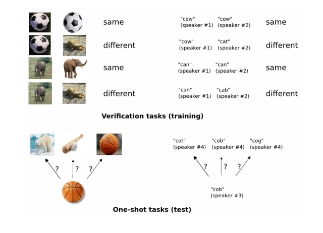
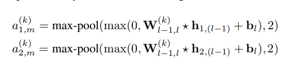
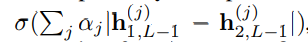
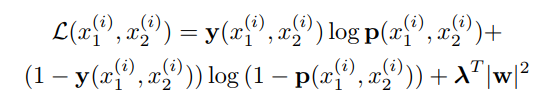
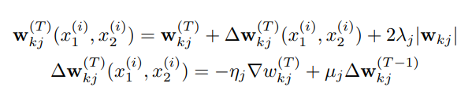
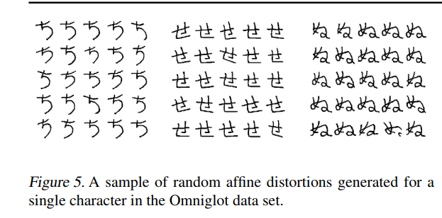
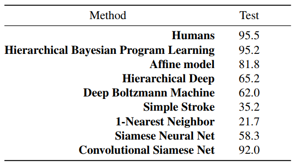

Siemese Network / One Shot Learning
===

### Our General Strategy
---

1) Train a model to discriminate
between a collection of same/different pairs.
2) Generalize to
evaluate new categories based on learned feature mappings for
verification.

In general, we learn image representations via a supervised
metric-based approach with siamese neural networks, then
reuse that network’s features for one-shot learning without
any retraining.

### Model
---

#### Layers
- h1,l: the hidden vector in layer l for the first twin
- h2,l:  the hidden vector in layer l for the second twin
- rectified linear (ReLU) units in the first L − 2 layers and
sigmoidal units in the remaining layers.

#### Filters and Activations
- filters of varying
size and a fixed stride of 1
- ReLU activation function
to the output feature maps
-  followed by maxpooling
with a filter size and stride of 2. Thus the kth filter
map in each layer takes the following form:

#### Flatten and FC
- Wl−1,l: 3-dimensional tensor representing the
feature maps for layer l
- The units in the final convolutional layer are flattened into
a single vector.
- This convolutional layer is followed by
a fully-connected layer, and then one more layer computing
the induced distance metric between each siamese
twin

#### Prediction Vector

- where σ is the sigmoidal
activation function. This final layer induces a metric on
the learned feature space of the (L − 1)th hidden layer
and scores the similarity between the two feature vectors.
- The αj are additional parameters that are learned
by the model during training, weighting the importance
of the component-wise distance. This defines a final Lth
fully-connected layer for the network which joins the two
siamese twins.

### Learning
---

#### Loss function

#### Optimization
- ηj - learning rate
- µj - momentum
- λj - L2 regularization weights

- where ∇wkj is the partial derivative with respect to the
weight between the jth neuron in some layer and the kth
neuron in the successive layer.

#### Weight initialization
- Weights initialized zero-mean and a standard deviation of 10^−2.
- Bias initialized with mean 0.5 and standard deviation 10−2
- fully-connected layers, the biases were initialized in the same way as the convolutional layers
- weights were drawn from a much wider normal distribution with zero-mean and standard
deviation 2 × 10^−1

#### Learning Rate
- η(T)j = 0.99η(T −1)  1 percent per epoch
- momentum 0.5 in every layer and then  µj

#### Hyperparameter optimization
- For learning scheduleand regularization hyperparameters, we set the layerwise
- learning rate ηj ∈ [10−4, 10−1]
- layer-wise momentum µj ∈ [0, 1], and layer-wise L2 regularization penalty
λj ∈ [0, 0.1]. 
- For network hyperparameters, convolutional filters vary from 3x3 to 20x20
- number of convolutional filters in each layer varied from
16 to 256 using multiples of 16. 
- Fully-connected layers ranged from 128 to 4096 units, also in multiples of 16. 
- We set the optimizer to maximize one-shot validation set accuracy.
The score assigned to a single Whetlab iteration w

#### Affine distortions
- we augmented the training set with small affine distortions

#### Result

#### Reference
- [oneshot](https://www.cs.cmu.edu/~rsalakhu/papers/oneshot1.pdf)
